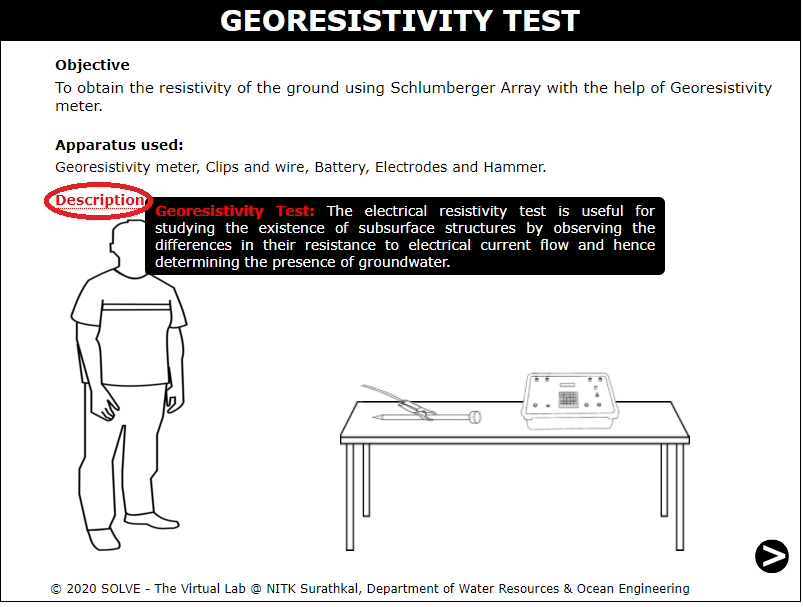
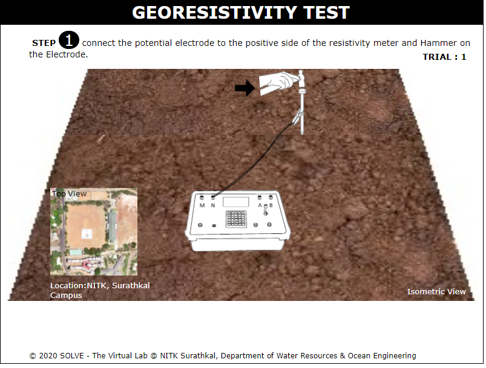
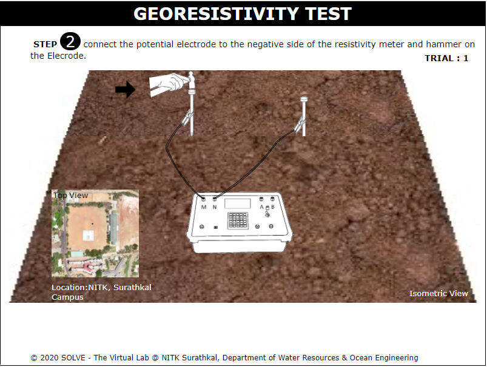
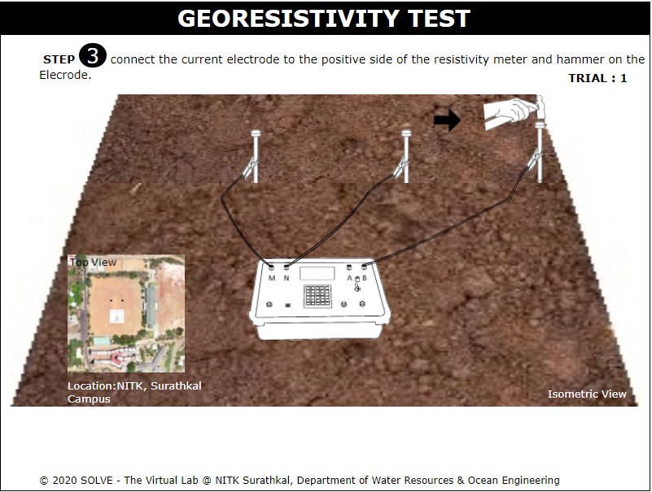
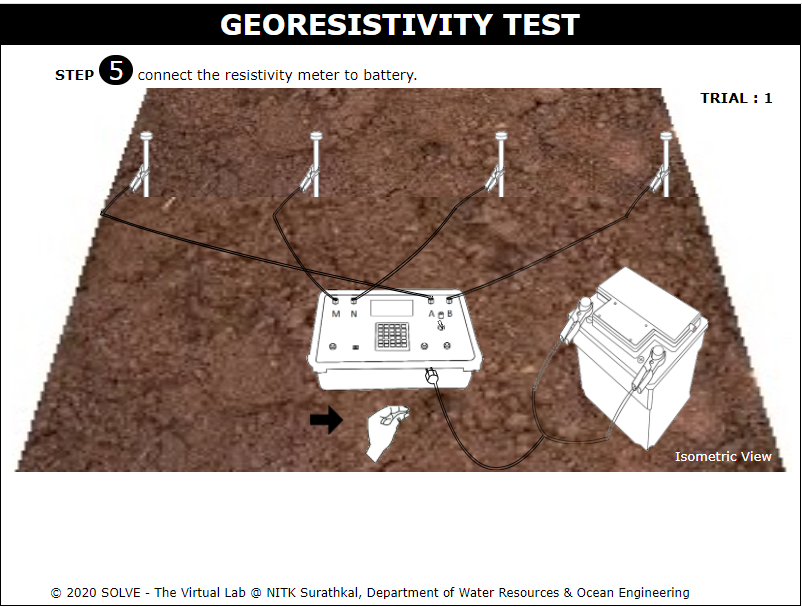
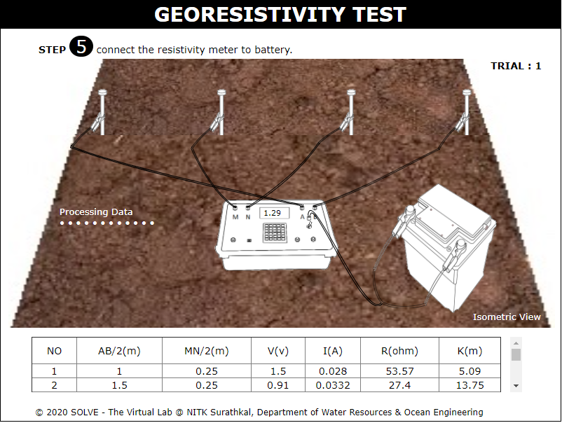
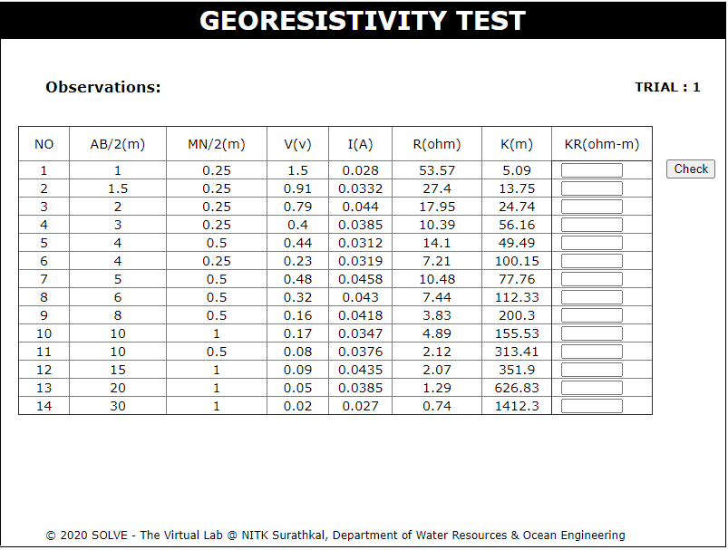
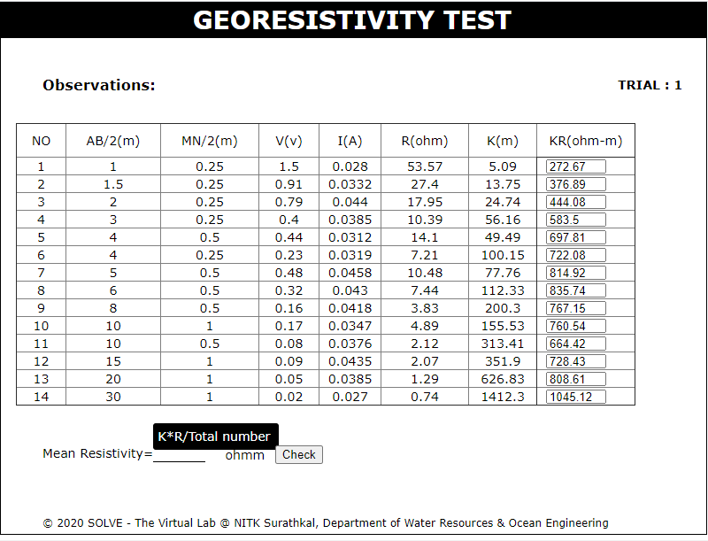
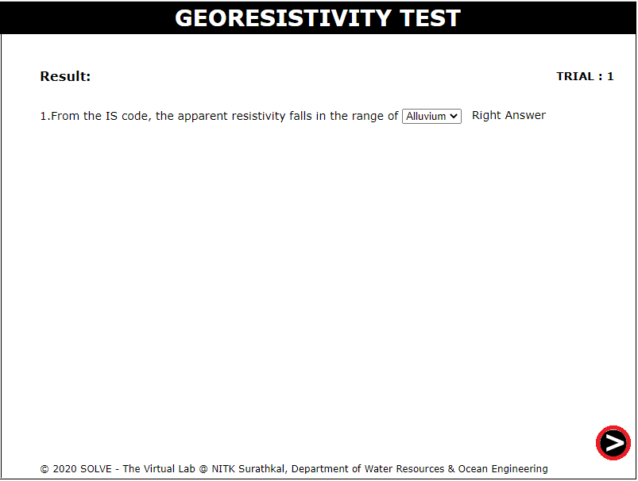

##### These procedure steps will be followed on the simulator

1. When you click Georesistivity test file, a new window will open as shown below. 
 

2. Connect the potential elecrode to the positive side of the resistivity meter and click on the hammer. 
 

3. Connect the potential elecrode to the negative side of the resistivity meter and click on the hammer.  
 

4. Connect the potential elecrode to the positive side of the resistivity meter and click on the hammer. 
 

5. Connect the potential elecrode to the negative side of the resistivity meter and click on the hammer. 
 

6. Click on the hand to connect the resistivity meter to the battery. Click on the next button to proceed further. 
 

7. click on the hand to switch on the Resistivity meter and note down the Resistance reading from the meter. Click on the next button to proceed further. 
 

8. click on the CHECK button to get the values of KR. 
 

9. Now click on the CHECK button to get the value of Mean Resistivty. 
 

10. Now choose the final result from the dropdown. and Repeat same Procedure for trial2 and trial3.  
 

