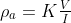
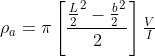

### INTRODUCTION

The electrical resistivity method is a geophysical technique used to determine the apparent resistivity of soils and rocks as a function of electrode depth or position. Soil resistivity is influenced by several factors, including porosity, permeability, ionic content of pore fluids, and the presence of clay minerals.

In hydrogeological and environmental investigations, the most commonly used electrical method is Vertical Electrical Sounding (VES), also known as resistivity sounding. In this method, a pair of current electrodes is placed at a specified distance apart, and the potential difference is measured between another pair of potential electrodes. These electrodes are generally arranged in a linear configuration. Common electrode array configurations include dipole–dipole, pole–pole, Schlumberger, and Wenner arrays.

The apparent resistivity represents the average resistivity of all soils and rocks influencing the flow of electric current. It is determined by dividing the measured potential difference by the applied current and multiplying the result by a geometric factor that depends on the electrode arrangement and spacing.

The Schlumberger array is a widely used geotechnical investigation method for determining the electrical resistivity of soil. It is similar to the Wenner method but provides more detailed and accurate measurements due to its electrode configuration. In this arrangement, the potential electrodes are placed relatively close together, while the current electrodes are positioned farther apart.

The Schlumberger array is one of the most common electrode configurations used in vertical electrical sounding (VES). The equation for apparent resistivity (𝝆a) is derived from the potential difference between two inner electrodes (M and N) caused by the current injected through two outer electrodes (A and B).

##### The Standard Equation

The general formula for apparent resistivity is:

For the Schlumberger configuration, the geometric factor (K) is defined by the spacing of the electrodes:

Where, 
L=The distance between the current electrodes (AB) 
b=The distance between the potential electrodes (MN) 
V=The voltage difference between the potential electrodes 
I=The applied  current. 

#### Interpretation of Resistivity Sounding Data

When apparent resistivity is plotted against electrode spacing (Schlumberger configuration) for various spacings at a single location, a smooth curve can be drawn through the plotted points.

The interpretation of such a resistivity–spacing curve in terms of subsurface conditions is a complex and often challenging task.  
The solution is generally approached in two stages:

1. Interpretation in terms of subsurface layers
    - Determination of the true resistivities of different layers and their corresponding depths.
2. Geological and hydrogeological interpretation
    - Interpretation of the obtained resistivity values in terms of subsurface geological formations and groundwater conditions.