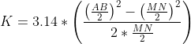

### Theory

The electrical resistivity method is a technique used to assess the apparent resistivity of soils and rocks as a function of electrode depth or position. Soil resistivity is influenced by factors such as porosity, permeability, ionic content in pore fluids, and clay mineralization.

In hydrogeological and environmental investigations, the most commonly employed electrical method is the Vertical Electrical Sounding (VES) or resistivity sounding. During resistivity surveys, a pair of current electrodes is placed at a specific distance from each other, and the potential difference is measured between another pair of potential electrodes. These electrode pairs are typically arranged in a linear configuration. Common electrode array configurations include dipole-dipole, pole-pole, Schlumberger, and Wenner arrays.

The apparent resistivity represents the average resistivity of all the soils and rocks affecting the electric current. It is calculated by dividing the measured potential difference by the input current and then multiplying it by a geometric factor specific to the chosen electrode array and spacing. The Schlumberger array is a geotechnical investigation method which determines the electrical resistivity of the soil.  

The Schlumberger array is a geotechnical investigation method which determines the electrical resistivity of the soil. This is similar to the Wenner probe test, but it uses multiple current electrodes rather than just two. This allows for a more detailed and accurate measurement of soil resistivity.

The Schlumberger arrangement has the potential electrodes close together. The apparent resistivity is  calculated by  

When apparent resistivity is plotted against the electrode spacing  Schlumberger for various spacing one location, a smooth curve can be drawn through the points.
The interpretation of such a resistivity-spacing curve in terms of subsurface conditions is a complex and frequently difficult problem. The solution can be obtained two parts.
i. Interpretation in terms of various layers of actual resistivity and their depths. 
ii. Interpretation of the actual resistivities in terms of subsurface geologic and ground
water conditions. 
