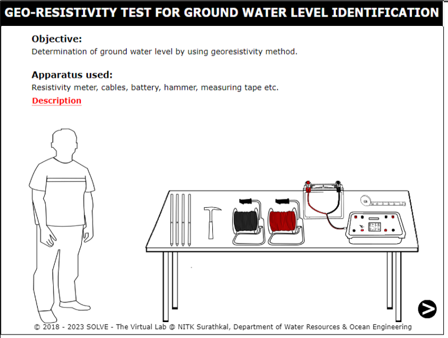
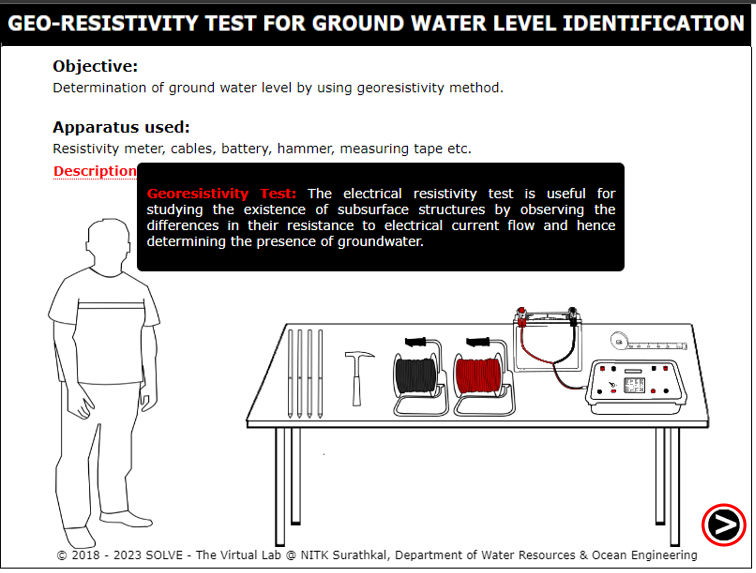
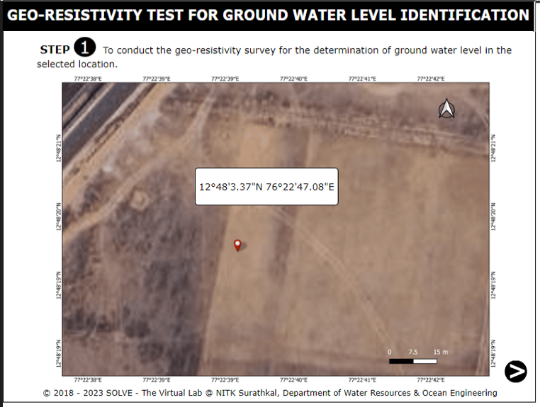
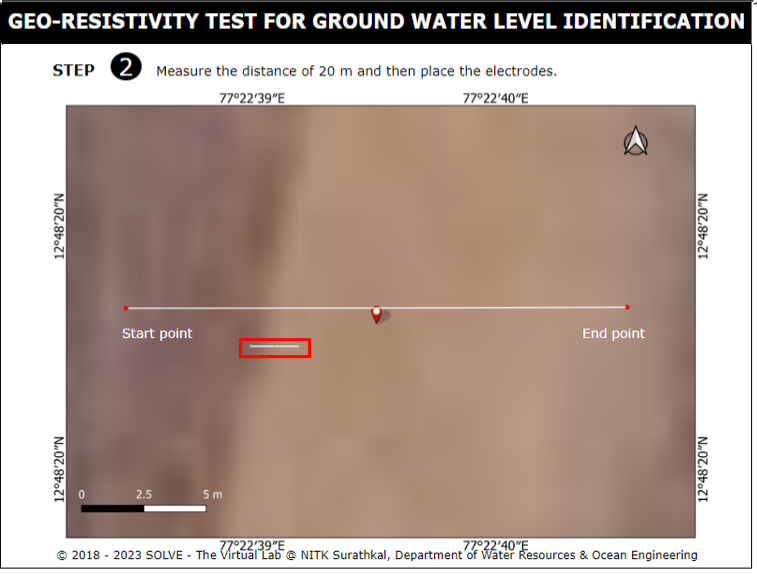
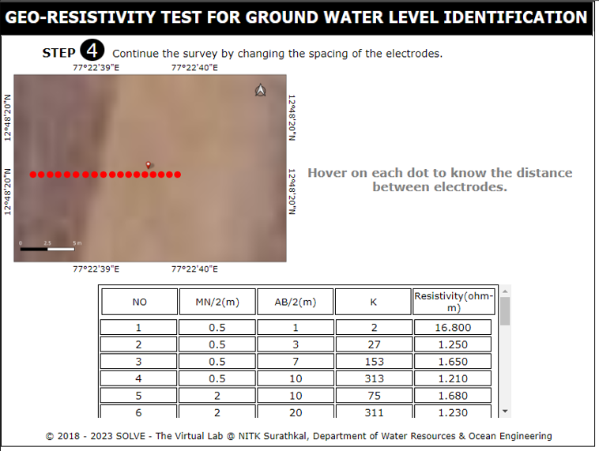
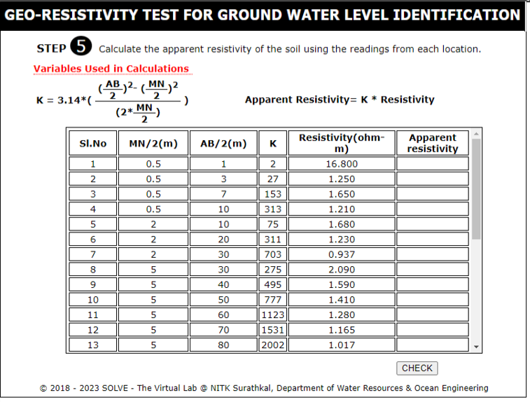
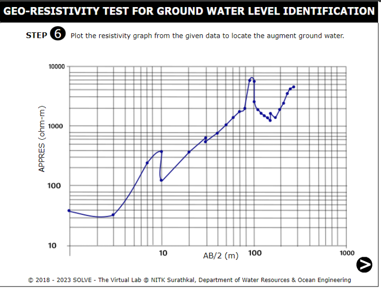
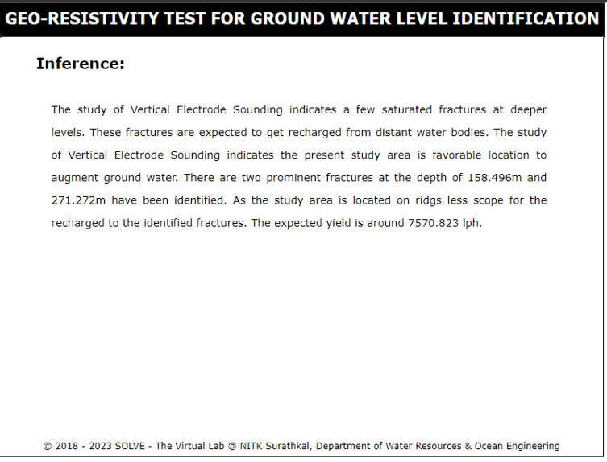

1. Click on the simulation tab of this experiment. The following window will be displayed.
    

2. Place the cursor over description, the basic definition of experiment will be displayed. Click on the next button to proceed with the experiment.
    

3. Select the study area and hover on the area to know its latitude and longitude value.
    

4. Click on the measuring tape to measure the distance of 20m from the starting point to end point.
     

5. Click on each electrodes to place it in the given distance and then connect the resistivity meter to the electrode and record the resistivity values.
    

6.  Take the reading and repeat the process at multiple locations to get the representative sample of the soil.
     

7.  Hover on each dot to know the distance between the electrodes as well as the resistivity values.
     

8.  Click on the next button and then place the mouse over the "Variables used in the calculation" to display all the variables and also calculate the apparent resistivity values using the table below.
     

9. From the survey the augmented ground water can be shown via graph.
     
     

10. Finally we have the inference of the experiment and reload the page to repeat the experiment.
    